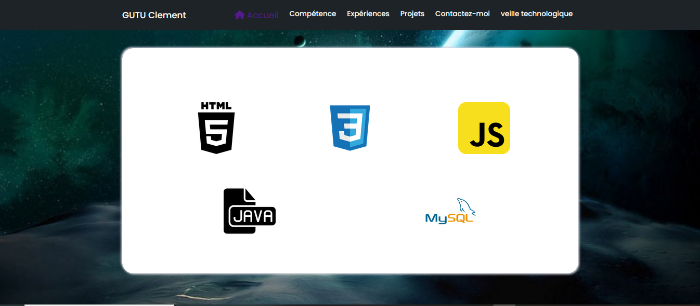

## Bonjour
Gutu Clément , j'ai 20 ans et je suis étudiant en BTS SIO a l'école ITIC PARIS. Dans le cadre de mes etudes, vous pourrez suivre au fur et a mesure l'evolution de mon portefolio.

Maitrise des Systèmes
Linux et Windows .
Bonne connaissance des
fondamentaux réseaux.
Bonne connaissance en
Programmation et en
Sécurité des données.

 ### Lien :
[Lien vers le site](https://clementgutu.github.io/Portfolio/)

 &copy; "Gutu Clément "
